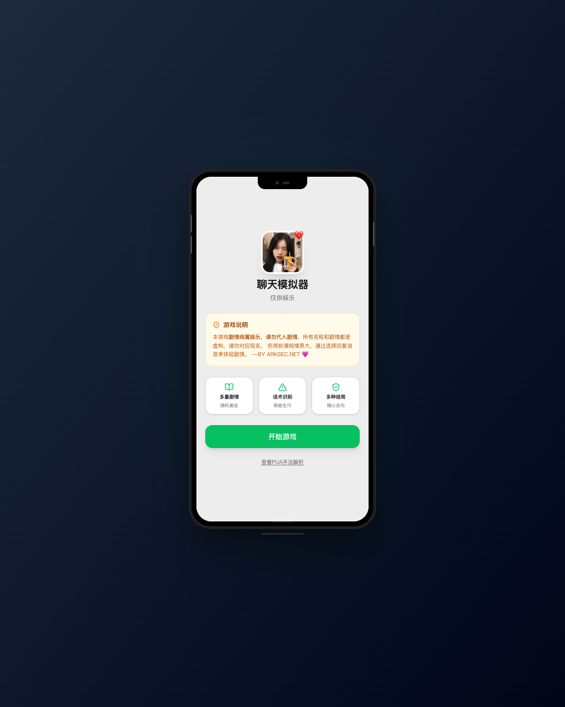
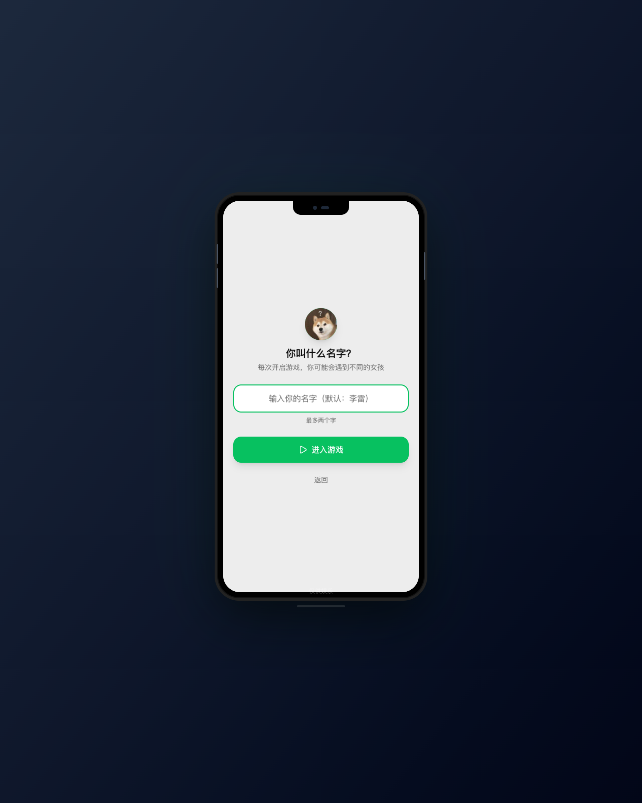
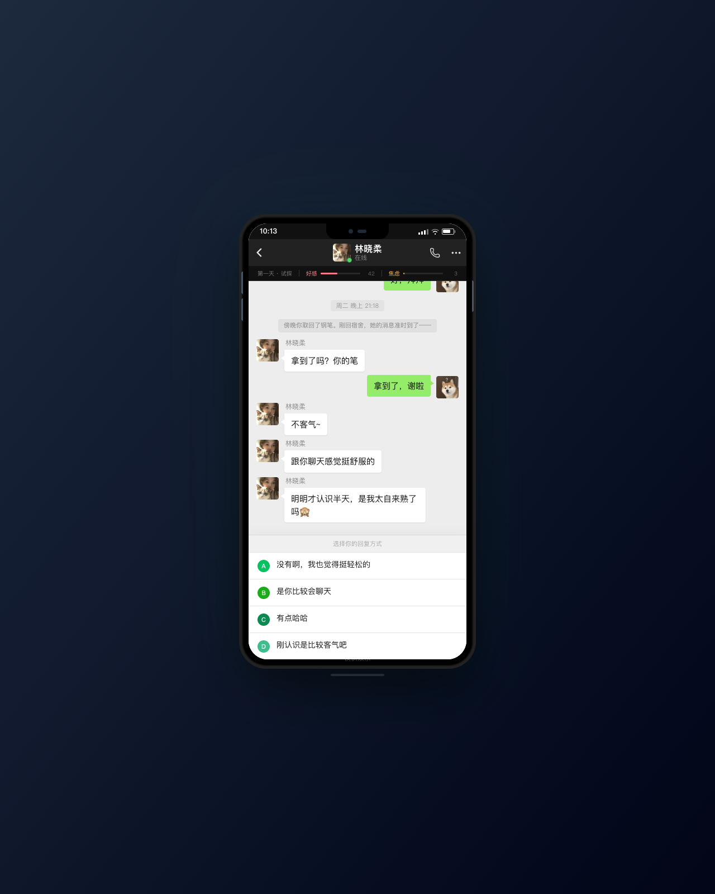
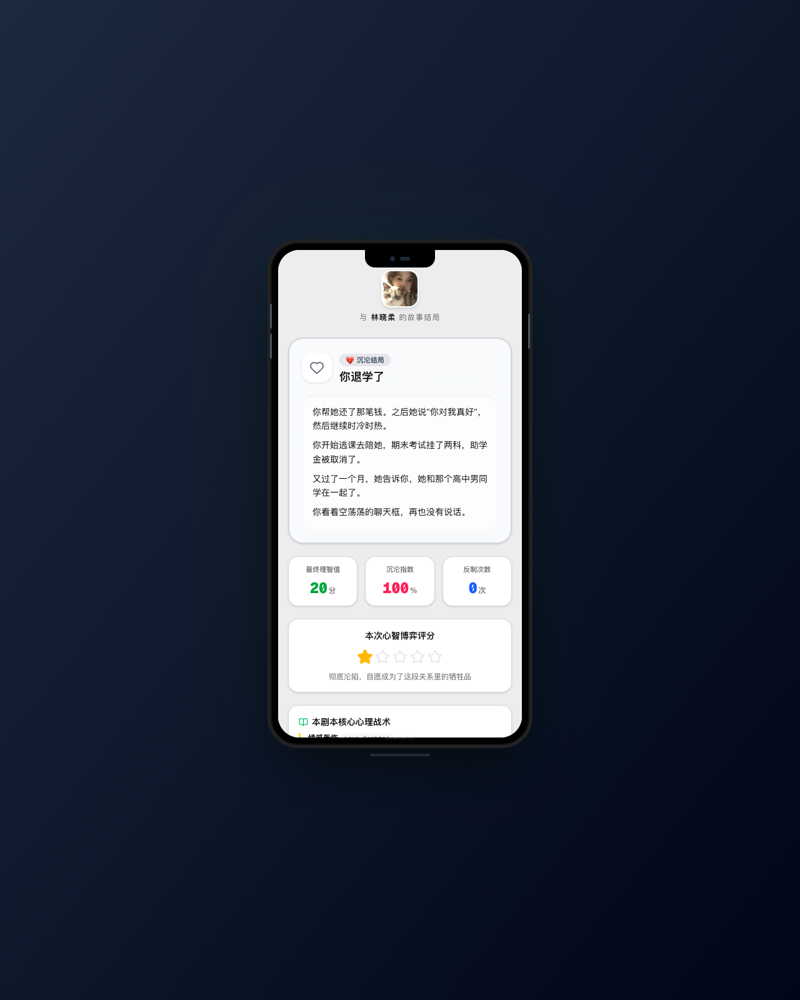

# chat-simulator

一个生产可部署的 Next.js 互动式中文聊天剧情模拟器。前端保持微信聊天式 UI，后端通过 Next.js API Route 代理 DeepSeek，让浏览器永远不直接接触 DeepSeek API Key。

- Demo: <https://chat.vibecoco.ai/>
- License: MIT
- AI model: `deepseek-v4-flash`

## Screenshots

| Home | Name setup |
| --- | --- |
|  |  |

| Chat gameplay | Ending summary |
| --- | --- |
|  |  |

## Project status

- Single Next.js app; the repository root is the production entry point.
- Mobile chat UI, story engine, state management, and structured story data are modularized.
- Backend `/api/ai/chat` wraps DeepSeek requests so production never exposes the API key to the browser.
- AI replies use the original script line as a plot anchor and fall back to the script line on failure or timeout.
- Favicon, app icon, and Apple touch icon are included.
- MIT License, contribution notes, security notes, and production deployment docs are included.
- Documentation screenshots are committed once under `docs/screenshots/`; generated current screenshots stay out of git to keep clone size controlled.

## Deployment

Vercel project `chat-vibecoco-ai` is connected to GitHub repository `worldwonderer/chat-simulator`. Pushing to the `main` branch triggers a production deployment automatically. Next.js pages and `app/api/*` backend routes are published in the same Vercel build.

## Architecture

```text
Browser UI
  └─ calls /api/ai/chat
       └─ server-side DeepSeek proxy
            └─ https://api.deepseek.com/chat/completions
```

The browser only calls this project's backend. It never receives `DEEPSEEK_API_KEY`. The server proxy enforces an origin allowlist, body size limit, rate limit, DeepSeek timeout, and no-store JSON responses.

## Repository layout

```text
.
├── app/                     # Next.js pages and API routes
│   └── api/ai/chat/         # DeepSeek server-side proxy
├── components/              # Chat simulator UI and game runtime
├── data/                    # Stories, characters, chapters, and tactic data
├── docs/                    # Production, open-source notes, and screenshots
│   └── screenshots/         # Public README screenshots and visual baselines
├── lib/ai/                  # DeepSeek server-side client
├── public/                  # Avatars, favicon, and static assets
├── scripts/                 # Repository, AI, and visual verification scripts
└── output/visual-baseline/  # Optional local current screenshots; not committed
```

## Quick start

```bash
npm install
cp .env.example .env.local
# Fill DEEPSEEK_API_KEY in .env.local
npm run dev
```

Production build:

```bash
npm run build
npm run start -- --port 4180
```

## Environment variables

```bash
DEEPSEEK_API_KEY=your DeepSeek API key
DEEPSEEK_MODEL=deepseek-v4-flash
DEEPSEEK_BASE_URL=https://api.deepseek.com
DEEPSEEK_TIMEOUT_MS=8000
APP_PUBLIC_URL=https://chat.vibecoco.ai
AI_ALLOWED_ORIGINS=https://chat.vibecoco.ai
AI_MAX_REQUEST_BODY_BYTES=16384
AI_RATE_LIMIT_WINDOW_MS=60000
AI_RATE_LIMIT_MAX_REQUESTS=30
```

`DEEPSEEK_API_KEY` is a server-only variable. Do not use a `NEXT_PUBLIC_*` prefix and do not commit it to git.

## Verification

```bash
# Full local verification
npm run verify

# Individual checks
python3 scripts/check_repository.py
npm run verify:ai
npm run build
python3 scripts/verify_visual_baseline.py
npm audit --omit=dev
```

`verify:ai` uses a mocked DeepSeek request to verify the production-critical path: endpoint, model, authorization source, disabled thinking mode, origin allowlist, payload size limit, custom player-name context, and health route.

## Clone-size policy

To keep the repository fast to clone:

- Do not commit `node_modules/`, `.next/`, `.env*`, logs, or temporary downloads.
- Do not commit `output/visual-baseline/current-*.png`.
- Keep only the compressed README screenshots in `docs/screenshots/`.
- Compress new image assets before committing them.
- Do not commit design source files or oversized ad-hoc screenshots.

## Adding a new story

When adding a story, the default files to update are:

- `data/girls.json`
- `data/scenes.json`
- `data/chapters.json`, if the chapter structure changes
- Character images under `public/`

The home flow randomly selects a character from `data/girls.json`, so newly connected stories enter the random pool automatically.

### 1. Add a character entry

Add a character object in `data/girls.json`:

```json
"yue": {
  "id": "yue",
  "name": "岳宁",
  "avatar": "/yue.png",
  "tags": ["段位：三星", "新剧本标签1", "新剧本标签2"],
  "description": "一句简介",
  "firstScene": "yue_scene_01"
}
```

Place the avatar at:

```bash
public/yue.png
```

### 2. Add the story tree in `scenes.json`

Add story nodes in `data/scenes.json`. Use an isolated prefix such as `yue_`:

```json
{
  "id": "yue_scene_01",
  "chapter": 1,
  "title": "初见",
  "timeLabel": "周三 晚上 20:10",
  "messages": [
    { "id": "s1", "sender": "system", "content": "[TIME] 周三 晚上 20:10", "delay": 400 },
    { "id": "m1", "sender": "her", "content": "你好呀" }
  ],
  "choices": [
    {
      "id": "a",
      "label": "A",
      "text": "你好",
      "replyText": "你好",
      "affectionDelta": 2,
      "anxietyDelta": 0,
      "nextScene": "yue_scene_01_ans_a",
      "badgeText": "礼貌"
    }
  ]
}
```

Story progression uses two mechanisms:

- `choices[].nextScene`: jump after a player choice.
- `autoNext`: jump automatically after the current node finishes.

### 3. Prefer explicit ending data

The most stable ending approach is to place `endingData` directly on the ending scene, so no JavaScript change is required:

```json
{
  "id": "yue_ending_good_01",
  "chapter": 6,
  "messages": [
    { "id": "s1", "sender": "system", "content": "你终于看清了。" }
  ],
  "isEnding": true,
  "endingType": "good",
  "endingData": {
    "title": "清醒结局：及时止损",
    "desc": "结局描述..."
  }
}
```

If `endingData` is omitted and you want to reuse randomized ending pools, update both:

- `components/chat/endingPools.js`
- `components/chat/gameEngine.js`

Otherwise, the new story prefix will not map to the intended ending pool.

## Documentation

- [`docs/production.md`](docs/production.md) — Production deployment, security boundary, and environment variables
- [`docs/open-source.md`](docs/open-source.md) — Open-source scope and release notes
- [`CONTRIBUTING.md`](CONTRIBUTING.md) — Contribution notes
- [`SECURITY.md`](SECURITY.md) — Security policy
- [`LICENSE`](LICENSE) — MIT License
